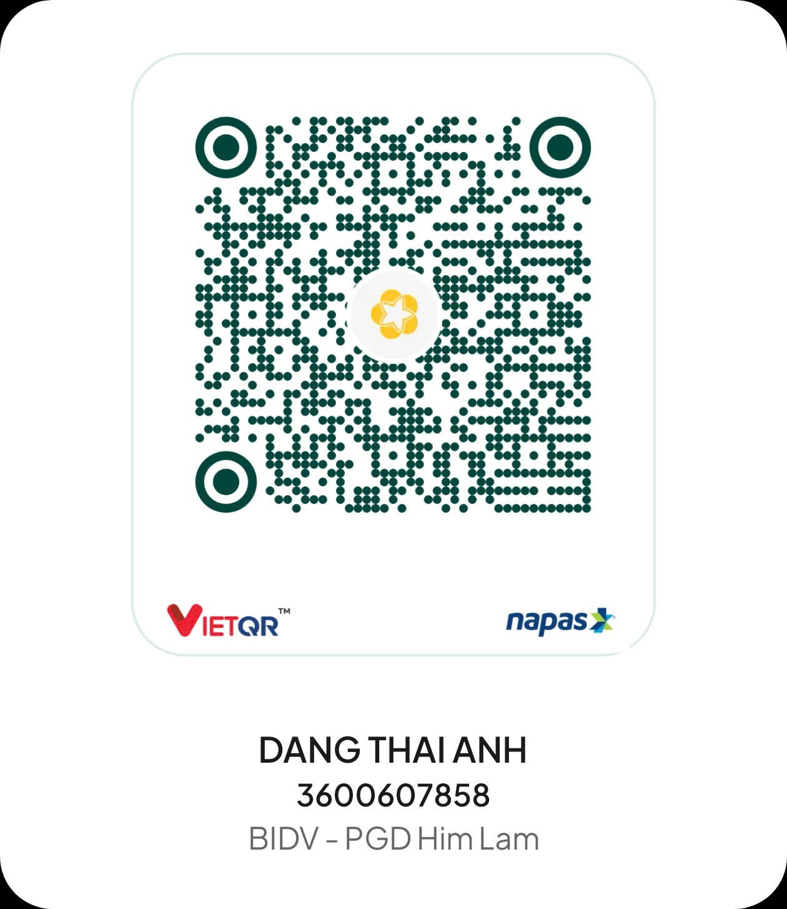
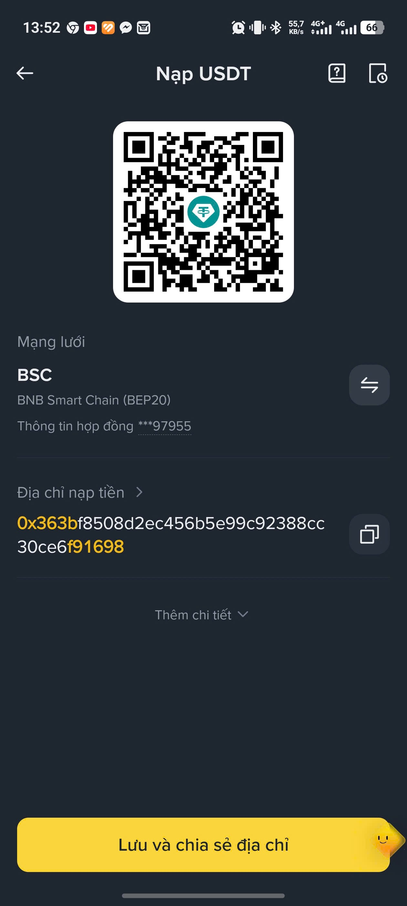

# Codex Login Bypass Phone Ver

A small Chrome extension that exports the current ChatGPT web session into JSON formats commonly used by Codex wrappers and 9router.

The extension runs locally in your browser. It does not send tokens to any external server. You choose a format, it reads `https://chatgpt.com/api/auth/session` with your existing ChatGPT cookies, then downloads a JSON file.

## Export Formats

### `auth.json`

Use this when a tool expects the original Codex-style auth file:

```json
{
  "auth_mode": "chatgpt",
  "OPENAI_API_KEY": null,
  "tokens": {
    "id_token": "...",
    "access_token": "...",
    "refresh_token": "...",
    "account_id": "..."
  },
  "last_refresh": "2026-07-06T00:00:00.000Z"
}
```

### `9router-codex-bulkadd.json`

Use this with the 9router Codex provider Bulk Add modal:

```json
[
  {
    "accessToken": "...",
    "refreshToken": "...",
    "idToken": "...",
    "email": "you@example.com"
  }
]
```

## Install

1. Download or clone this repository.
2. Open Chrome or a Chromium-based browser.
3. Go to `chrome://extensions`.
4. Enable `Developer mode`.
5. Click `Load unpacked`.
6. Select this repository folder.
7. Log in to `https://chatgpt.com`.
8. Click the extension icon.
9. Use `Copy 9router Bulk Add` for the fastest 9router import, or download one of the JSON files.
10. To convert an existing export, paste Sub2API, CPA, or `auth.json` into the converter box and copy/download the converted Bulk Add JSON.

## How It Works

The extension calls:

```js
fetch("https://chatgpt.com/api/auth/session", { credentials: "include" })
```

Then it builds:

- a synthetic `id_token` with the ChatGPT account id, plan type, user id, email, issue time, and expiry
- an `auth.json` file for Codex-style tools
- a 9router-compatible Bulk Add array
- a one-click clipboard copy of the 9router Bulk Add array

## Convert Existing Exports

The popup can convert these formats into one 9router Bulk Add array:

- Sub2API exports with `accounts[].credentials`
- CPA or portable exports with `access_token`, `refresh_token`, `id_token`, and `email`
- Codex `auth.json` with a `tokens` object

Paste the JSON, then choose `Copy converted` or `Download`.

## Security Notes

The downloaded JSON contains active session credentials. Treat it like a password.

- Do not commit exported JSON files.
- Do not share exported JSON files publicly.
- Remove old exports when you no longer need them.
- Re-export after logging in again if a token expires.

## Error Check

If Codex shows `Your access token could not be refreshed`, read [TROUBLESHOOTING.md](TROUBLESHOOTING.md). It includes a safe PowerShell check for `%USERPROFILE%\.codex\auth.json` that does not print raw tokens.

## Support

If this project helps you, you can buy me a coffee with VND or USDT.

### VND

- Name: `DANG THAI ANH`
- Bank: `BIDV - PGD Him Lam`
- Account: `3600607858`



### USDT

- Network: `BSC / BEP20`
- Address: `0x363bf8508d2ec456b5e99c923888cc30ce6f91698`



## Files

```text
manifest.json  Chrome extension manifest
popup.html     Extension popup UI
popup.js       Session fetch, JSON builders, and download logic
converter.js   Sub2API / CPA / auth.json to Bulk Add converter
assets/        Donation QR images
```

## Development

This project has no build step and no dependencies. Edit the files, then reload the extension from `chrome://extensions`.

Run the converter self-check with:

```bash
node checks/converter-self-check.mjs
```
